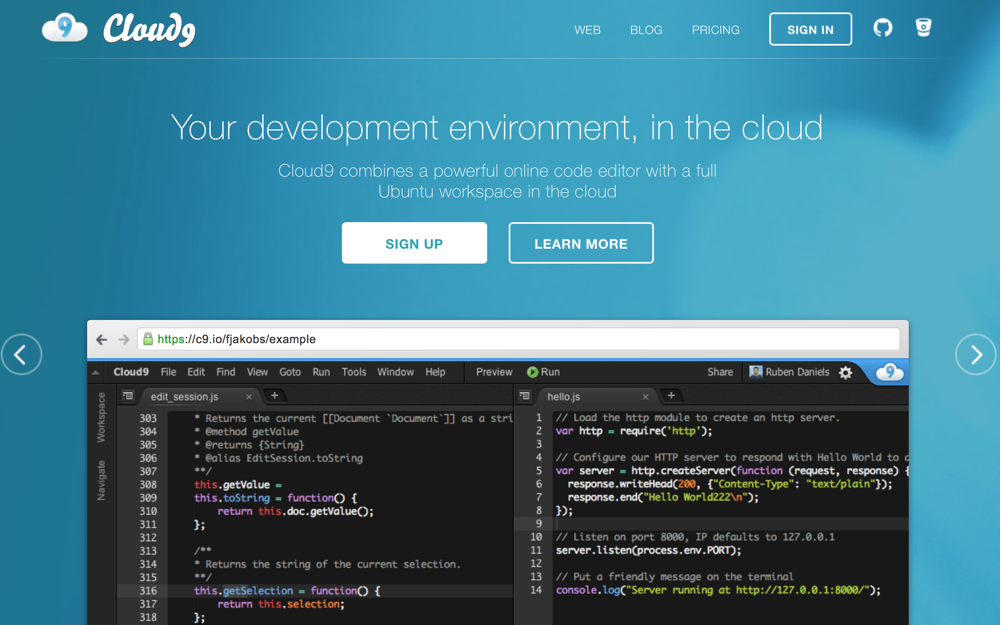
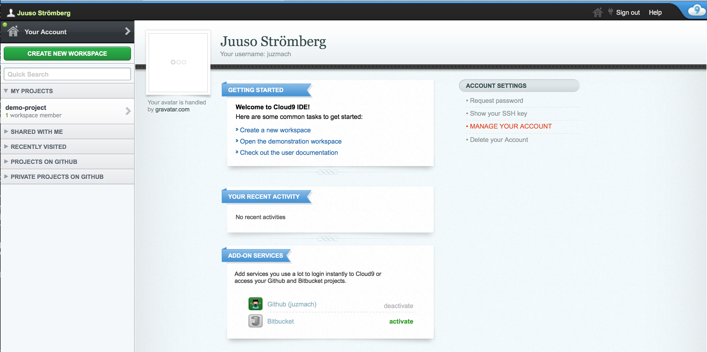
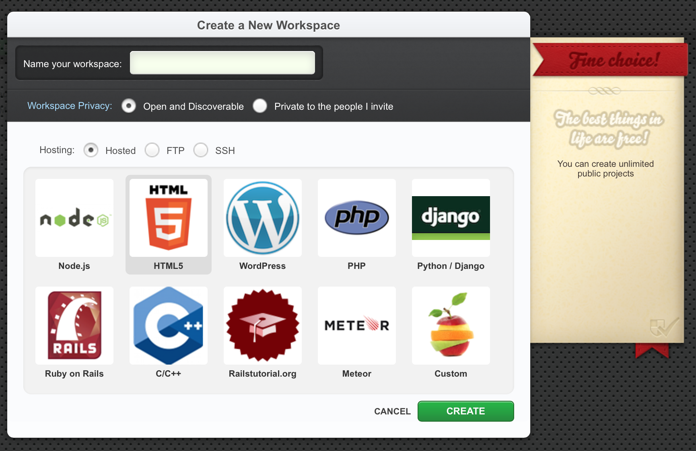
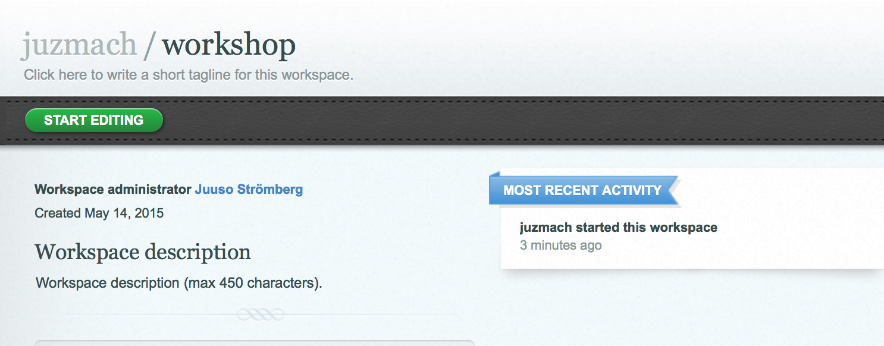
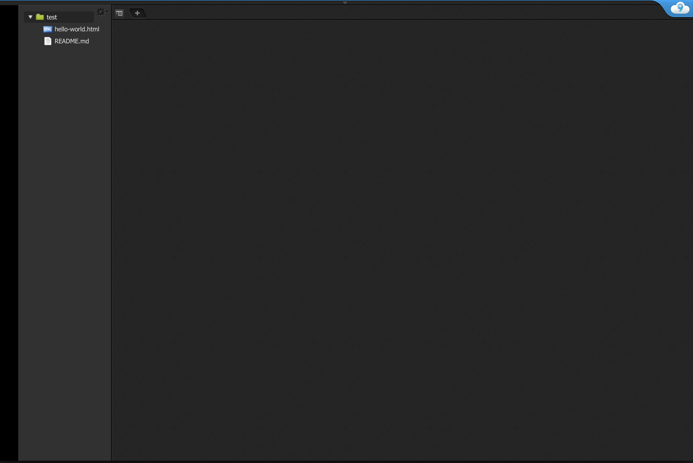

* TOC    
{:toc}
{: .toc}

# Introduction

Welcome to the HTML Workshop material site. This site is made specifically for the workshop held in May 2015 for Aalto university's economics students, but the material is free for everyone to use. The materials are aimed for people who have no prior experience in HTML, CSS, JavaScript or website development in general. 

Web development is a huge subject nowadays. In fact it is so huge that there is an entire world built around it. And it's growing constantly, as businesses and services are migrating to web. Because of this, we can't possibly go over everything there is to web development in our limited time. What we are going over in this workshop are the very basic topics that build the very foundation of today's web.

The goal of this workshop is to get you off to a good start on learning web development.

# Setting up the environment

Let's go shortly over the basic tools we're using.

## Tools we're using

Creating websites do not require any fancy equipment. You only need a text editor and a browser! Most web developers have started their journey writing everything in Windows Notepad.

However, today there are a plethora of different editors and IDEs (Integrated Development Environments, basically editors with more complex features) that one can use, everyone of them has their own merits and downsides.

For our workshop, the choice of tools is limited by our location. I've found two editors that are suitable:

### Notepad / Gedit / TextEdit

The obvious one that is found on any Windows machine. On linux the alternative is Gedit and TextEdit on OS X. It's also very lightweight, but the reason is neglected by real development teams is that it lacks finer features that many other editors have, like syntax highlighting.

Typical workflow with Notepad includes writing the HTML, CSS and JavaScript files in Notepad (making sure to save them with `.html`, `.css` and `.js` filetypes respectfully), and opening the `.html` files with a web browser. 

### Cloud9 - A Browser-based IDE

Cloud9 Home Page

The second option is a browser-based IDE [Cloud9](https://c9.io) that looks very promising. It is an IDE, meaning that it's got more features than a simple text editor and it runs in a browser, which means it runs on almost any computer with a modern browser.

Personally I think this is the better alternative, but if for some reason it doesn't work, then I see no shame in using Notepad.

#### Setting up Cloud9

In fact, let's go over setting up Cloud9 real quick. Signing up is really simple. Just click the Sign Up -button and register.

Once you've got yourself an account and logged in, you'll be greeted with the dashboard

Cloud9 Dashboard

On the left side you can see your projects. When you want to start working on a new project, click the green button **Create New Workspace**. It'll open up a popup menu, where you have to select **Create New Workspace** again.

Select HTML5 from this window

A window pop ups like in the image above. For most of this workshop we'll be working with the HTML5 project, so select that. Give the project a name and press **Create**.

The Project Page with Start Editing button

You return back to the dashboard, but notice on the left side there is a new project building up with the name you gave. After it's ready and available, click it. The project page opens up in the main section. From there you can click the **Start editing** button to go to the editor.

In the next window, Cloud9 will ask you the editor layout. I suggest selecting the minimal editor mode, as the full IDE mode might look a bit overwhelming. You can change these layouts anytime from the top menubar: **Window -> Presets** (If it's not showing, just click the topmost area of the site, just a little bit below the blue line at the very top).

Finally, the editor! It's so dark!

Now we're finally somewhere! The project has some basic files already included, like a `hello-world.html` file and a `README.md` file. But we don't have to worry about those yet.

#### One thing of note about Cloud9

Cloud9 is free to use for public projects. The free account gives you one private project, but for more you need to subscribe to one of their pricing plans.

For our purposes, the free account will do just fine. **If you're anxious about giving out private information online, use fake information in our exercises and/or use the private project.**

# HTML

# Sources

[University of Helsinki's Web Development Course 2015](http://web-selainohjelmointi.github.io)
