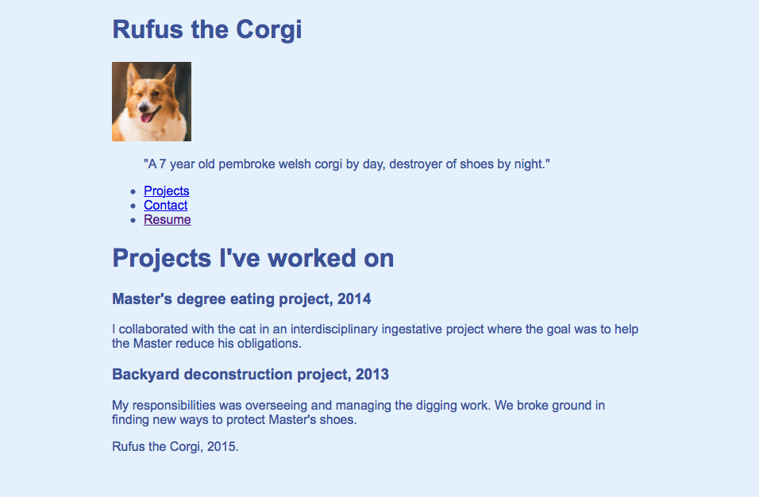

* TOC    
{:toc}
{: .toc}

# Introduction

Welcome to the HTML Workshop material site. This site is made specifically for the workshop held in May 2015 for Aalto university's economics students, but the material is free for everyone to use. The materials are aimed for people who have no prior experience in HTML, CSS, JavaScript or website development in general. 

Web development is a huge subject nowadays. In fact it is so huge that there is an entire world built around it. And it's growing constantly, as businesses and services are migrating to web. Because of this, we can't possibly go over everything there is to web development in our limited time. What we are going over in this workshop are the very basic topics that build the very foundation of today's web.

The goal of this workshop is to get you off to a good start on learning web development.

# Setting up the environment

Let's go shortly over the basic tools we're using.

## Tools we're using

Creating websites do not require any fancy equipment. You only need a text editor and a browser! Most web developers have started their journey writing everything in Windows Notepad.

However, today there are a plethora of different editors and IDEs (Integrated Development Environments, basically editors with more complex features) that one can use, everyone of them has their own merits and downsides.

For our workshop, the choice of tools is limited by our location. I've found two editors that are suitable:

### Notepad / Gedit / TextEdit

The obvious one that is found on any Windows machine. On linux the alternative is Gedit and TextEdit on OS X. It's also very lightweight, but the reason is neglected by real development teams is that it lacks finer features that many other editors have, like syntax highlighting.

Typical workflow with Notepad includes writing the HTML, CSS and JavaScript files in Notepad (making sure to save them with `.html`, `.css` and `.js` filetypes respectfully), and opening the `.html` files with a web browser. 

### Cloud9 - A Browser-based IDE

Cloud9 Home Page

The second option is a browser-based IDE [Cloud9](https://c9.io) that looks very promising. It is an IDE, meaning that it's got more features than a simple text editor and it runs in a browser, which means it runs on almost any computer with a modern browser.

Personally I think this is the better alternative, but if for some reason it doesn't work, then I see no shame in using Notepad.

#### Setting up Cloud9

In fact, let's go over setting up Cloud9 real quick. Signing up is really simple. Just click the Sign Up -button and register.

Once you've got yourself an account and logged in, you'll be greeted with the dashboard

Cloud9 Dashboard

On the left side you can see your projects. When you want to start working on a new project, click the green button **Create New Workspace**. It'll open up a popup menu, where you have to select **Create New Workspace** again.

Select HTML5 from this window

A window pop ups like in the image above. For most of this workshop we'll be working with the HTML5 project, so select that. Give the project a name and press **Create**.

The Project Page with Start Editing button

You return back to the dashboard, but notice on the left side there is a new project building up with the name you gave. After it's ready and available, click it. The project page opens up in the main section. From there you can click the **Start editing** button to go to the editor.

In the next window, Cloud9 will ask you the editor layout. I suggest selecting the minimal editor mode, as the full IDE mode might look a bit overwhelming. You can change these layouts anytime from the top menubar: **Window -> Presets** (If it's not showing, just click the topmost area of the site, just a little bit below the blue line at the very top).

Finally, the editor! It's so dark!

Now we're finally somewhere! The project has some basic files already included, like a `hello-world.html` file and a `README.md` file. But we don't have to worry about those yet.

#### One thing of note about Cloud9

Cloud9 is free to use for public projects. The free account gives you one private project, but for more you need to subscribe to one of their pricing plans.

For our purposes, the free account will do just fine. **If you're anxious about giving out private information online, use fake information in our exercises and/or use the private project.**

# HTML

HTML stands for Hypertext Markup Language. It is the standard language used to create web pages. Above you can see a very basic HTML file. HTML uses tags enclosed in angle brackets (like `<html>`) called **HTML elements** to describe what is shown on the page. There are a lot of different HTML elements with their own purposes, and we'll go over most of them in this workshop. Among other things as well.

## What does HTML look like?


<!DOCTYPE html>
<html>
    <head>
        <meta charset="utf-8" />
        <title>The Page title in the top bar of the browser</title>
    </head>
    <body>
        <h1>A header</h1>
        
This is a paragraph where you can write any kind of text.

    </body>
</html>

A basic HTML file saved in `index.html` file, for example.

When we open our example HTML document in a browser it looks like this:

The main thing you should notice about the elements is that they always come in pairs: `<html></html>` or `<body></body>`. It means that the element tag always has it's closing tag, identified by the forward slash `/` inside the angle brackets. Why? Well the main reason is that we can add stuff inside the element, like in our example above.

However, some elements don't need a closing tag. Like that `<meta>` element, for example. The reason is that we don't have to (or actually we can't) put any content inside that element. These are called *self-closing elements*.

Well what's that `charset="utf-8"` thing inside the `<meta>` tag then? That is an **attribute**. Attributes *extend* HTML elements, either by changing its appearance or providing metadata for it. The reason for attributes might be a bit confusing at the moment, but it'll become clear once we really start to use them. 

### The main elements of an HTML document


<!DOCTYPE html>
<html>
    <head>
        <meta charset="utf-8" />
        <title>The Page title in the top bar of the browser</title>
    </head>
    <body>
        <h1>A header</h1>
        
This is a paragraph where you can write any kind of text.

    </body>
</html>


Let's go over the elements we see in that example.

The first one is `<!DOCTYPE html>`, which identifies that everything inside this file is HTML. It is needed every time we want to write HTML. The second important element for us is the `<html>` element. Inside it we write every other element we need in our web page.

Now inside the `<html>` element we see two HTML elements with other elements inside it. The `<head>` and `<body>` tags. These two elements are where we're going to do most of our work in, especially in the latter. `<head>` element is where we add general information (metadata) about the HTML document, most commonly the document title (with `<title>` element) that shows up at the top of the browser. But there are other elements that go there as well, like the `<meta>` element that can be used to add metadata for the document. In our example, we use it to set the document's [character set](http://en.wikipedia.org/wiki/Character_encoding) to `utf-8`.

Now on to the `<body>` element. Inside this element we write everything we want to show in our document. It is truly the body of our document. In our example we have a header `<h1>` and a paragraph `
`.

With the header element you can have headers with different sizes when you change the number on the element tag. For example:

### Summary

A single `<html>` is called **an HTML tag**.

An **HTML element** has *a starting tag* and *a closing tag*: `<html></html>`.

Some HTML elements don't have a closing tag, they're called **self-closing elements**: `<meta />`. (The element closes itself with the `/>` in the end)

An HTML element can have **attributes** that change the behaviour or appearance of the element: `<meta charset="utf-8" />` or `<h1 style="color: blue;">This header is blue</h1>`.

Every HTML document starts with `<!DOCTYPE html>`.

Every element goes inside `<html></html>`.

The `<head>` element is the mind of the document. It covers all the abstract information about it, stuff you don't see on the document. Except the `<title>`.

The `<body>` element is the body of the document. Everything inside it is visible to the person viewing the document/site.

The `<h1>` element is a header and you can specify the size and hierarchy with the number in the element tag. The size range is 1-6.

The `
` element is a paragraph element. Inside it you can write normal text.

# Assignment: Personal portfolio site

In this workshop we're going to practice our website building skills by creating a personal portfolio site. We're going to start by creating the HTML documents for the site and adding content into them and then adding more features step by step. I'm going to use an imaginary person on this site as an example, but you can obviously make the site for yourself or someone else. And of course **you don't have to follow the examples religiously. You are free (and encouraged) to add your own modifications.**

The resulting site would look something like [this](/html-workshop/example/).

## Ex. 1: Setup the index.html

Create a new file called `index.html` and copy the snippet below inside it. Give the page a **title**.


<!DOCTYPE html>
<html>
	<head>
		<meta charset="utf-8" />
		<title></title>
	</head>
	<body>
		
	</body>
</html>

It's dangerous to go alone! Take this!

### Why index.html?

The reason lies in how web servers (the computers where your site, meaning the HTML documents you've created, are *hosted*) are built. When a user visits a site, say http://www.janedoe.com/, the web server where the site http://www.janedoe.com/ is located receives a request from the user's browser and automatically returns the index.html document. The index.html is the home page, or index page, of the site, and it is something that web servers are always looking for.

However, if the user wants to open up a different page on the site, say `about.html`, the address would be http://www.janedoe.com/about.html .

## Ex. 2: Adding content

Now we should have an index.html document with the main elements inside it. If we open that up in a browser (if using Notepad or the like just right-click the saved index.html document and select *Open with* -> *Google Chrome/Mozilla Firefox/etc.*, or if you're using Cloud9: Right-click and select *Preview* from the list).

But there's nothing in here!

We need to add some content here. Let's start by adding some projects and a short description of yourself. **Add a *Who am I?* section and at least one project into the site.** The result should look something like this:

*Hint: Use header elements `<hX>` and paragraph element `
`. X being the size of the header.*

# Continuing with HTML

Let's find out what other types of content we can put in our site. So far we've only used headings and paragraphs, and those are only just the surface!

## Lists

HTML supports lists. We can do all kinds of lists, in fact. We can do **ordered lists** or **unordered lists**, for example.

Unordered list:

<ul>
    <li>List item 1</li>
    <li>List item 2</li>
    <li>List item 3</li>
</ul>


Ordered list:

<ol>
    <li>List item 1</li>
    <li>List item 2</li>
    <li>List item 3</li>
</ol>


It looks quite simple, and it is. You just have to specify the list with either a `<ol>`or `<ul>` element, and then add each list item with the `<li>` element.

## Links

Links are important. Almost every web page has links. You can add links with the `<a>` element. 

You can use it like this:

<a>http://juzmach.github.io/html-workshop/example/</a>


And it shows up like this:

<a>http://juzmach.github.io/html-workshop/example/</a>

Or you can put the link address into the `href=""` attribute inside the element. Then you can create a link with custom text. Or another HTML element!

You use it like this:

<a href="http://juzmach.github.io/html-workshop/example/">Link to example site</a>


And it shows up like this:

<a href="http://juzmach.github.io/html-workshop/example/">Link to example site</a>

### Note on link addresses and the href attribute

If you want to make a link for another page on the same site, you can set the `href=""` attribute like this:


<a href="/html-workshop/example/">Link to another page on the same site</a>


So you can omit the *base address* of the site and just begin the address with a forward-slash. In the example above the site sends the user to `http://juzmach.github.io/html-workshop/example/`, where `juzmach.github.io` is the base address. If you made a link like this:


<a href="/">Link</a>


It would send you to `http://juzmach.github.io/`. Or to the base address where your site is hosted on.

## Images

You can add images to the page with the `` element. This element is special as it is a self-closing element (remember what those are? If not, here's the TL;DR: They close themselves with the `/>` thing in the end). But there's also another reason: **The `` element needs two *attributes*, `src=""` and `alt=""` in order to work.**

The `src=""` attribute is where you put the *source* of the image. Basically, if you have an image file `image.jpg` in the same directory as the HTML document, you specify the source like this: `src="image.jpg"`. If it's in another folder, say in a sub-directory that's in the same directory as the HTML document, you write it like this: `src="FOLDERNAME/image.jpg"`.

The `alt=""` attribute tells us what the `` is going to tell the user if the image source is not found.

This is when the image is found:

<!-- I have to use the width="" attribute as well to make the image smaller. 
     This is a HTML comment, by the way :)
     It does not show on the site. -->



This is when the image is not found:




Even better is if you add `title=""` attribute to the element. Then it shows a pop-up text when you hover over the image.





# Assigment: More content

## Ex. 3: Add an image to the page

Download an image somewhere from the net and add it to the page. Make sure to set the attributes correctly.

*Hint: Download it to the same directory where the HTML document is to make it easier*

## Ex. 4: Add a list of links to the page

Add a list of links to the page. It can be either a navigational list of links 

After these exercises, your site should look something like this:

You might have wondered why our assignment looks so bland when we preview is on a browser. It really looks nothing like the sites you see nowadays. Where are all the colors? Can't we at least change the font?

# Introducing CSS

## Let's make things pretty (or more *vibrant* at least)

So here comes CSS. CSS stands for Cascading Style Sheet. And what that means that it is a set of instructions that tells the browser *how the site is going to look like*. CSS is formally called a style sheet language and it goes hand-in-hand with HTML when making web sites. Because, **where HTML is for the structure and the actual content of the site, CSS is for the look and the appearance of the site**.

## CSS Syntax


body {
    background-color: #E4F1FE;
    font-family: Arial;
    color: #3A539B;
    width: 70%;
    margin:auto;
}

aside {
    width: 20%;
    float: right;
}

article {
    width: 70%;
}

Example CSS

The things you see above are called **CSS rules** or **rule sets**. 


body {
    background-color: #E4F1FE;
    font-family: Arial;
    color: #3A539B;
    width: 70%;
    margin:auto;
}

A single CSS rule.

A CSS rule consists of a **selector** and a **declaration**. A selector points to the HTML element that we want to style (notice how the CSS has familiar words from the HTML we used before? That's right! *They're all linked*.). So in this case, `body` is the selector and it points to the `<body>` element in HTML.

A declaration is a line inside the curly brackets (`{ }`). A declaration has a **property** and a **value**. In our example, we have a `background-color: #E4F1FE;` declaration that gives the `<body>` element (or the whole page, since it is the body element) a blueish background. `background-color` is property and `#E4F1FE` (color in hexadecimal format) is the value. 

To summarize the syntax, here's a nice picture:

**Note: The declarations must end with a semicolon (`;`)**.

## Colors, fonts and sizes

Let's go over some properties that we can use to change things.

### Colors

`background-color` is for changing the background color. [More about background-color](https://developer.mozilla.org/en-US/docs/Web/CSS/background-color)

`color` is for changing the text color. [More about color](https://developer.mozilla.org/en-US/docs/Web/CSS/color)

### Fonts

`font-family` is for setting the font of the site. In it you can actually specify a list of fonts, or font families. The list is prioritized, so when user visits the site, his/her browser looks at the list and picks the first font to use in the site. If that font is not installed in the user's computer, then the browser picks the second font et cetera. [More about font-family](https://developer.mozilla.org/en-US/docs/Web/CSS/font-family)

`font` 

### Sizes

`font-size` is for changing the font size. You can use units such as `px`(pixel), or scaling units such as `em` or `%` (percentile). [More about font-size and units](https://developer.mozilla.org/en-US/docs/Web/CSS/font-size)

`width` is for changing the *width* of an element. You can use the same units as in `font-size`. [More about width](https://developer.mozilla.org/en-US/docs/Web/CSS/width)

`height` is the same thing but for *height* of the element. [More about height](https://developer.mozilla.org/en-US/docs/Web/CSS/height)

#### One thing to remember about using *absolute* and *relative* units

Pixel (`px`), even centimeter (`cm`) and inches (`in`), are absolute units available in CSS. Absolute means that when you use these units, the size of the element is *fixed*, meaning it won't change no matter what you do.

`em`, `rem`, `%`, and point (`pt`) are all relative units, meaning their true size depends on different things. The reason for needing relative units is that they can scale more easily from one screen size to another.

[Here](http://www.w3.org/TR/css3-values/#lengths) is the actual specification for these units.

All this might sound pretty confusing (and it's okay), but you'll get the hang of it once you start trying out all of them.

## Linking CSS with HTML

CSS is usually saved into a `.css` file somewhere close to the HTML document we want to use it in. Sometimes just a single `style.css` (name doesn't really matter) is fine, but in larger web sites you might see all the CSS files put into a separate `css/`-folder.

Well, say we have a `style.css` file saved in the same folder as our `index.html`, how do we use it? We need a `<link>` element.

`<link>` Element specifies relationships between the document and external resources, like a `.css` file ([Source](https://developer.mozilla.org/en-US/docs/Web/HTML/Element/link)). To link our CSS into the HTML document, we need to put the `<link>` element inside our `<head>` element like this:


<head>
    <link rel="stylesheet" href="style.css" type="text/css" />
    <title>A HTML Document with a linked CSS file</title>
</head>

A self-closing element with *three* attributes!

The first attribute specifies the *relationship* of the external resource. In this case we specify it as a stylesheet, because it's CSS.

The second attribute specifies the location of the resource. Note: If the file was in another folder, we would need to specify it like this: `href="FOLDER_NAME/style.css"`.

# Assignment: Adding colors

## Ex. 4: Add a background color to your page

You can use [this](http://www.crockford.com/wrrrld/color.html) or [this](http://www.flatuicolorpicker.com) to find colors. When using the colors in the former link, you can just type the names into the value. The latter link has the colors in hexadecimal format that you can use like this: `#EF4836` or RGB format that you can use like this: `rgb(239,72,54)`.

## Ex. 5: Add colors to your text and headers

Use separate selectors for practice!

## Ex. 6: Change the font

Change the font used in the site to whatever you like. Remember that not all fonts are *websafe*, meaning that not every font is found on the user's computer. And if a font is not found on the user's computer, it means that it will not show. That is why the `font-family` property is a prioritized list, so there is always something to fall back to.

You can use [this](http://web.mit.edu/jmorzins/www/fonts.html) site to figure out a web-safe font for you to use. Or [this](http://www.cssfontstack.com) one.

# Classes and IDs

Now your page should have some color. Our example page, for example, looks like this:

Nothing spectacular, but more colorful at least.

Now you might have noticed that when you have multiple same elements in the HTML file and you change their appearance with the element selector, it changes the appearance of **all** the elements with the same tag.

Say you have multiple `<section>` elements, and you applied this CSS rule:


section {
    background-color: lime;
}


Now **every** `<section>` element would have a lime-colored background! How do we separate the elements?

With classes and IDs.

## Classes

A class is an attribute you can give to an HTML element. It can be *classify* multiple elements. Say you had HTML code like this:



    I want this text to be blue

    I want this text to be black

    I want this text to be blue 



And CSS like this:


p {
    color: blue;
}


Can you figure out what that would do?

...

... It would turn all the text blue! Now, if we edited the code a little bit:

HTML:


    I want this text to be blue

    I want this text to be black

    I want this text to be blue



CSS:

.blue-text { <-- Class selectors are marked with a dot.
    color: blue;
}


Now the texts would have the right colors.

## IDs

You can also use ID attributes to separate elements. The difference between a class and an ID is that with the ID attribute you can target *single* elements, whereas the class attribute is for targeting multiple elements.

You can use IDs like this:

HTML:


    I want this text to be blue

    I want this text to be black

    I want this text to be blue



CSS:

#black-text { <-- ID selectors are marked with a hash.
    color: black;
}


# Structuring our HTML

After you completed the second exercise of our assignment, your code probably looks something like this:


<!DOCTYPE html>
<html>
    <head>
        <meta charset="utf-8" />
        <title>Rufus the Corgi</title>
        <link rel="stylesheet" href="third.css" type="text/css" />
    </head>

    <body>
        
        <h1>Rufus the Corgi</h1>
        
        
        <blockquote>
            "A 7 year old pembroke welsh corgi by day, destroyer of shoes by night."
        </blockquote>
            
        <ul>
            <li><a href="#">Projects</a></li>
            <li><a href="#">Contact</a></li>
            <li><a href="/html-workshop/resume">Resume</a></li>
        </ul>

        <h1>Projects I've worked on</h1>
        
        <h3>Master's degree eating project, 2014</h3>
        
        

            I collaborated with the cat in an interdisciplinary ingestative project where the goal was to help the Master reduce his obligations.
        

        
        
        <h3>Backyard deconstruction project, 2013</h3>
        
        

            My responsibilities was overseeing and managing the digging work. We broke ground in finding new ways to protect Master's shoes.
        

        
        

            Rufus the Corgi, 2015.
        

    
    </body>
</html>

If you see this code before doing the second exercise, please do not copy-paste it or you won't learn anything.

Now, this bit of code is not very structured. And when we move forward we're going to have problems once we want to start to do positioning etc.

And in this context structuring means organizing the code in a smart and logical way, like grouping meaningful parts of the code together.

## Structuring in HTML: The Old Way

Before HTML5 came along there were structuring elements like `
` and ``. Especially `
` element was heavily used in structuring HTML. You can use these elements like this:


<!DOCTYPE html>
<html>
    <head>
        <title>Div test</title>
    </head>
    <body>
        

            
                <h1>header inside div</h1>
            
            
paragraph inside div

        

    </body>
</html>


But when we look that in the browser, we don't see a difference:

Why is that?

The reason is that `
` and `` elements are *containers* that don't inherently represent anything. Meaning that they are only used to group parts of the code together so that the code can be manipulated in groups. 

The difference between `
` and `` elements is that `
` is used for grouping multiple elements together, whereas the `` element is used for *inline* grouping, like say grouping together one part of a text inside `
` element.

These two elements are still available today, even with HTML5, but their usage and purpose has changed a little bit.

## Structuring in HTML: The HTML5 Way

HTML5 is the latest version of HTML. The new version has added lots of new elements into HTML, a total list of HTML elements you can find [here](https://developer.mozilla.org/en-US/docs/Web/HTML/Element).

HTML5 gives us new structuring elements that make our code more readable: `<section>`, `<article>`, `<header>`, `<footer>`, `<aside>` and others. Let's show them in action:


<!DOCTYPE html>
<html>
    <head>
        <meta charset="utf-8" />
        <title>Rufus the Corgi</title>
        <link rel="stylesheet" href="style.css" type="text/css" />
    </head>

    <body>
    
        

            
            <header>

                <h1>Rufus the Corgi</h1>
                
                
            
                <blockquote>
                    "A 7 year old pembroke welsh corgi by day, destroyer of shoes by night."
                </blockquote>
            
            </header>
            
            <nav>

                <ul>
                    <li><a href="#">Projects</a></li>
                    <li><a href="#">Contact</a></li>
                    <li><a href="/html-workshop/resume">Resume</a></li>
                </ul>
           
            </nav>

        
 

        

            
            

                
                <article id="projects">
        
                     <h1>Projects I've worked on</h1>

                    <section>
        
                       <h3>Master's degree eating project, 2014</h3>
        
                        

                            I collaborated with the cat in an interdisciplinary ingestative project where the goal was to help the Master reduce his obligations.
                        

        
                    </section>
        
                    <section>
        
                        <h3>Backyard deconstruction project, 2013</h3>
        
                        

                                My responsibilities was overseeing and managing the digging work. We broke ground in finding new ways to protect Master's shoes.
                        

        
                    </section>
        
                </article>
                
                <article id="contact">
                    
                </article>
            
            

    
            <footer>
    
                

                    Rufus the Corgi, 2015.
                

            </footer>
            
        

    </body>
</html>


Now our code has some structure. But let's look at what the changes look like in a browser:

Huh? It still looks the same!

Yes, the structuring elements themselves **do not change the appearance of the page**. Well, the headers work a bit differently now that they are inside grouping elements (Try changing the header size in one of the headers and preview the changes). But other than that, there are practically no changes in the appearance.

So why do we structure our code like this? Well, the first reason is that we want our code to be more readable for us and anyone else who wants to edit it. One might argue that adding new elements into the document only makes it harder to read, but when you use these elements intelligently, the purpose the sections becomes clear immediately.

With these new HTML5 elements, **you can specify a purpose for a section of the code**. Like in our example above: 

We use the `<header>` element to define a header section for the whole document.

We put the projects inside `<article>` element, because they are the real content of the document.

We sectioned each project with the `<section>` element.

Finally we sectioned the footer with `<footer>` element.

The second reason for structuring is so you can use CSS to modify the appearance of only the elements you want.

### The new HTML5 elements and div

While HTML5 brought new structuring elements into play, we still see the `
` element used from time to time. And that is okay. One good rule of advice for using `
` instead of the newer elements is that if none of the HTML5 elements work for you in the situation, use `
`. So use it only when there are no other elements available.

# Assignment: Continuing with the portfolio

## Ex. 7: Structure the index page

Think of what kind of layout you want for the page anduse the new HTML5 elements to structure the HTML code in the index.html document. 

# Positioning

So far we've been doing pretty simple things with CSS. Now we are getting to the hard parts. CSS has always been the butt of many jokes because of its behaviors that might sometimes be a bit illogical.

How you may or may not feel like after fiddling with CSS

Like this mug?

I don't mean to discourage you, on the contrary. Don't feel bad if you don't get the site looking the way you want at first. Just keep at it, and use google. **Seriously. Google is your friend when developing web sites or anything else.** There are tons of answers out there for almost any kind of problem regarding HTML and CSS. I use it all the time.

## The Box Model

Anyway, back to business.

In HTML and CSS there is a thing called **the box model**. Basically in an HTML document, every element is represented as a rectangular box. And when you add CSS rules to your document, those rules make changes to the elements' boxes.

# Borders

## A good article about best practices in CSS

[Over here](https://developer.mozilla.org/en-US/docs/Web/Guide/CSS/Writing_efficient_CSS)

<!--
# Sources

[University of Helsinki's Web Development Course 2015](http://web-selainohjelmointi.github.io)
[Mozilla Developer Network](https://developer.mozilla.org/en-US/docs/Web/HTML)
-->
